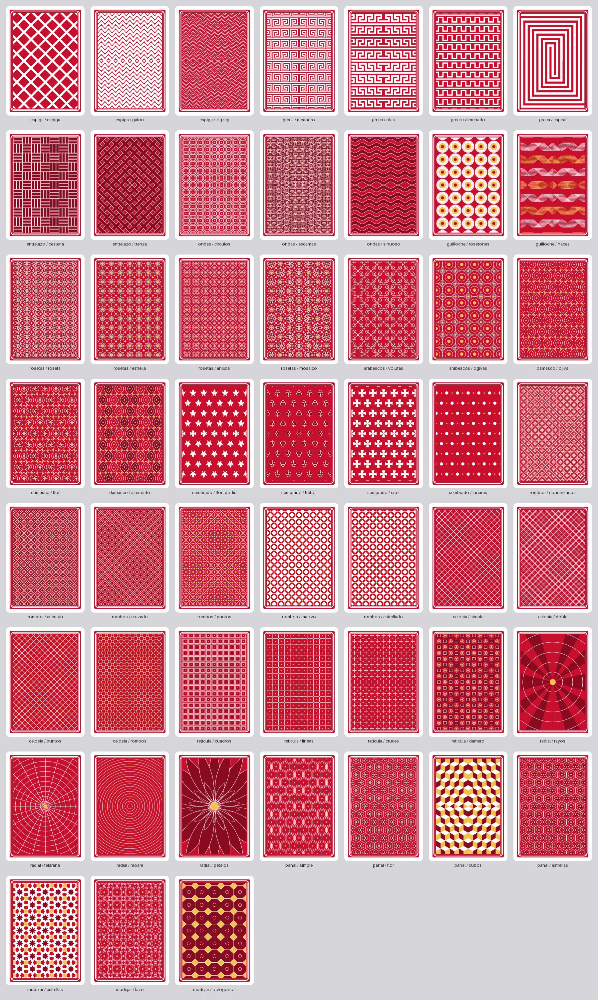
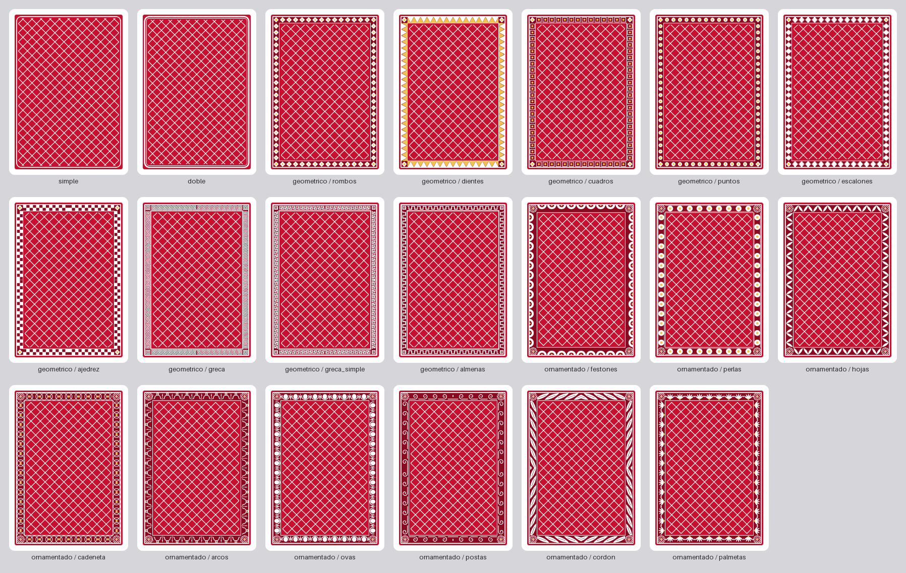

# Generador de dorsos

Genera proceduralmente dorsos de cartas tradicionales (simétricos, densos, ornamentales,
con paleta limitada y sin orientación evidente) a partir de primitivas geométricas. Sin
imágenes externas; la única dependencia es Pillow.

- **Formatos**: póker 63×88 mm y baraja española 61,5×95 mm (o `custom`).
- **Salida**: PNG a tamaño físico correcto (300 ppp por defecto, configurable; el `dpi`
  va en la cabecera y la configuración en un chunk de texto) y SVG en milímetros.
- **Todo es configuración JSON**: la misma configuración da siempre la misma imagen.

## Estructura

```
generador-dorsos/
├── dorsos/
│   ├── constants.py  config.py  errors.py  registry.py     # datos y validación
│   ├── geometry.py  primitives.py  scene.py                 # geometría y escena
│   ├── compose.py                                           # configuración → escena
│   ├── render_png.py  render_svg.py                         # salidas
│   ├── palettes.py  presets.py  presets/*.json  randomize.py
│   ├── sheet.py  cli.py  __main__.py
│   └── modules/  frames.py  medallions.py  corners.py  motifs.py  keys.py  patterns/
├── tests/          # pytest
├── docs/methodology/model.tex          # matemáticas: retículas, simetría, curvas
├── docs/documentation/module.md        # referencia de cada módulo
└── muestras/       # hojas de muestras generadas con `sheet`
```

Cada módulo ornamental declara sus opciones con `Opt`; de ahí salen la validación, los
valores por defecto, la randomización y el listado de `modules`. Añadir un módulo es una
clase con `@register("pattern", "nombre")`; ver `docs/documentation/module.md`.

## Instalación

```bash
pip install -r requirements.txt
```

Requiere Python 3.10 o superior. Se ejecuta desde esta carpeta (`generador-dorsos/`).

## Uso rápido

```bash
# Un preset a 300 ppp, PNG + SVG en salida/
python -m dorsos generate --preset marino-arcos

# Elegir dónde se guarda (se crea si no existe)
python -m dorsos generate --preset coral-celosia --out "C:/Users/PJ/Desktop/dorsos"

# Baraja española, 600 ppp, solo PNG
python -m dorsos generate --preset oro-nocturno --format espanola --dpi 600 --formats png

# Ajustar cualquier parámetro con rutas del JSON
python -m dorsos generate --preset verde-diamantes \
    --set frame.kind=geometrico --set 'frame.options={"motif":"puntos"}' \
    --set medallion.kind=roseta --set style.density=0.8 --set palette.background=#0b3d2e

# Diez dorsos aleatorios reproducibles (semillas 100..109), guardando su JSON
python -m dorsos generate --random --seed 100 --count 10 --save-config

# Aleatorizar solo algunas capas: el resto del preset se queda como está
python -m dorsos generate --preset marino-arcos --random pattern --count 6
python -m dorsos generate --preset marino-arcos --random palette medallion --count 6

# Hoja de muestras en cuadrícula (presets o aleatorios)
python -m dorsos sheet --presets --cols 6 -o muestras/presets.png
python -m dorsos sheet --random --count 18 --seed 1 --cols 6 -o muestras/aleatorios.png

# Catálogo: una carta por cada variante de una capa
python -m dorsos sheet --catalog frame --cols 7 -o muestras/marcos.png
python -m dorsos sheet --catalog pattern --cols 7 -o muestras/patrones.png

# Listar presets y módulos con todas sus opciones
python -m dorsos presets
python -m dorsos modules pattern
```

Desde Python:

```python
from dorsos import DorsoConfig, build_scene, render_png, render_svg, save_png

cfg = DorsoConfig.from_dict({"pattern": {"kind": "celosia"}, "medallion": {"kind": "rombo"}, "seed": 3})
scene = build_scene(cfg)
save_png(render_png(scene, cfg.dpi), "dorso.png", cfg.dpi, scene.metadata)
open("dorso.svg", "w", encoding="utf-8").write(render_svg(scene))
```

## Dónde se guarda

`--out` (o `-o`) es el directorio de salida de `generate`; por defecto `salida/`, relativo a
la carpeta desde la que se ejecuta. El directorio se crea si no existe y admite rutas
absolutas y relativas. En `sheet`, `-o` es el **fichero** de la hoja, no el directorio.

| Quiero | Orden |
|---|---|
| Directorio por defecto (`salida/`) | `python -m dorsos generate --preset marino-arcos` |
| Otro directorio | `python -m dorsos generate --preset marino-arcos -o dorsos-nuevos` |
| Ruta absoluta | `python -m dorsos generate --preset marino-arcos -o "D:/barajas/marino"` |
| Fijar el nombre del fichero | `... --name dorso-brisca` → `dorso-brisca.png` / `.svg` |
| Guardar también el JSON | `... --save-config` → `<nombre>.json` |
| Una hoja de muestras | `python -m dorsos sheet --presets -o muestras/presets.png` |

Los nombres se forman como `<preset o "dorso">.png`. Con `--count > 1` o con `--random` se
añade la semilla (`marino-arcos-100.png`), de modo que nunca se pisan entre sí. Un fichero
con el mismo nombre **sí** se sobrescribe.

## Órdenes y argumentos

Cuatro subórdenes: `generate`, `sheet`, `presets` y `modules`.

### Comunes a `generate` y `sheet`

| Argumento | Qué hace |
|---|---|
| `--preset NOMBRE` | Parte de un preset (`python -m dorsos presets` los lista). |
| `--config FICHERO.json` | Parte de un JSON propio; se mezcla sobre los valores por defecto. |
| `--format poker\|espanola` | Formato de carta. Por defecto `poker`. |
| `--dpi N` | Resolución del PNG, 30–1200. Por defecto 300. |
| `--seed N` | Semilla. Misma semilla y misma configuración ⇒ misma imagen. |
| `--set RUTA=VALOR` | Cambia un parámetro suelto. Repetible. El valor se lee como JSON y, si no lo es, como texto. |
| `--random [CAPA…]` | Aleatoriza. Sin nombres, todas las capas; con nombres, solo esas. |
| `--lock RUTA…` | Parámetros que `--random` conserva. |

El orden de prioridad es: valores por defecto → `--preset` → `--config` → `--format/--dpi/--seed` → `--set`.

### Solo `generate`

| Argumento | Qué hace |
|---|---|
| `-o`, `--out DIR` | Directorio de salida. Por defecto `salida/`. |
| `--name NOMBRE` | Nombre base de los ficheros, sin extensión. |
| `--formats png svg` | Qué formatos escribir. Por defecto los dos. |
| `--count N` | Cuántos dorsos, con semillas consecutivas. |
| `--save-config` | Guarda además el JSON completo de cada dorso. |

### Solo `sheet`

| Argumento | Qué hace |
|---|---|
| `-o`, `--out FICHERO` | PNG de la hoja. Por defecto `salida/muestras.png`. |
| `--presets` | Una carta por preset. Sin esta bandera, dorsos aleatorios. |
| `--catalog RANURA` | Una carta por cada variante de `frame`, `pattern`, `medallion` o `corners`. |
| `--count N` | Cuántos dorsos aleatorios. Por defecto 12. |
| `--cols N` | Columnas de la cuadrícula. Por defecto 6. |
| `--height N` | Alto en píxeles de cada carta. Por defecto 420. |

## Configuración

`--config fichero.json`, `DorsoConfig.load()` y los presets usan el mismo esquema. Todo
campo omitido toma su valor por defecto; una clave desconocida o un valor fuera de rango
es un error.

```json
{
  "version": 1,
  "format": "poker",
  "dpi": 300,
  "seed": 1,
  "palette": {"background": "#c8102e", "primary": "#ffffff", "secondary": "#8a0b20",
              "accent": "#f2c14e", "paper": "#ffffff"},
  "style": {"density": 0.5, "scale": 1.0, "margin_mm": 3.0, "line_width_mm": 0.25,
            "corner_radius_mm": 3.0},
  "symmetry": {"bilateral": true, "rotational_180": true},
  "frame":     {"kind": "doble",   "enabled": true, "options": {}},
  "pattern":   {"kind": "rombos",  "enabled": true, "options": {"style": "arlequin"}},
  "medallion": {"kind": "circulo", "enabled": true, "options": {"interior": "estrella"}},
  "corners":   {"kind": "none",    "enabled": true, "options": {}}
}
```

| Parámetro | Rango | Significado |
|---|---|---|
| `palette.background` | color | Fondo del campo, dentro del marco. |
| `palette.primary` | color | Trazo principal. Es el que más se ve. |
| `palette.secondary` | color | Rellenos y tono medio. |
| `palette.accent` | color | Detalles puntuales (botones, perlas, puntos). |
| `palette.paper` | color | Margen de papel de la carta, fuera del campo. |
| `style.density` | 0–1 | Detalle dentro de cada motivo: contornos anidados, pétalos extra, anillos. |
| `style.scale` | 0,4–3 | Tamaño de los motivos del patrón. Más escala, menos celdas. |
| `style.margin_mm` | 0–10 | Margen de papel entre el borde de la carta y el campo. |
| `style.line_width_mm` | 0,05–1,5 | Grosor base; cada módulo lo multiplica por su `weight`. |
| `style.corner_radius_mm` | 0–8 | Redondeo de la carta. Fuera de él el PNG es transparente. |
| `symmetry.bilateral` | sí/no | Espejo izquierda-derecha. |
| `symmetry.rotational_180` | sí/no | Giro de 180°: la carta no tiene derecho ni revés. |
| `seed` | entero | Semilla de la randomización y de la `variation` de los patrones. |
| `<ranura>.kind` | nombre | Módulo de esa ranura, o `none` para dejarla vacía. |
| `<ranura>.enabled` | sí/no | Apaga un módulo sin perder sus opciones. |
| `<ranura>.options` | objeto | Opciones del módulo, según las tablas siguientes. |

Un color es `#rrggbb` o el nombre de un rol de la paleta (`background`, `primary`,
`secondary`, `accent`, `paper`), que se resuelve al generar. Los presets usan roles para
que cambiar la paleta cambie el dorso entero de forma coherente.

## Patrones

El patrón es el fondo repetido que llena el campo. Hay 15 patrones con 52 variantes entre
todos. Comparten estas opciones:

| Opción | Por defecto | Qué hace |
|---|---|---|
| `style` | según módulo | Variante del motivo (ver la tabla de abajo). |
| `cell_mm` | según módulo | Tamaño de la celda en mm, antes de `style.scale`. |
| `line` | `primary` | Color del trazo o de la figura maciza. |
| `fill` | `secondary` | Color de los rellenos. |
| `dot` | `accent` | Color de los detalles pequeños. |
| `weight` | 1.0 (0,4–3) | Grosor, multiplica a `style.line_width_mm`. |
| `variation` | 0 (0–1) | Probabilidad de que una celda intercambie `line` y `fill`. Depende de la semilla. |

| Patrón | `style` | Aspecto | Opciones propias |
|---|---|---|---|
| `rombos` | `concentricos` | Rombos anidados con un punto central. | `gap` |
| | `arlequin` | Rombos alternos rellenos, como un arlequín. | |
| | `cruzado` | Rombo pequeño en el centro y puntos en los vértices. | |
| | `puntos` | Rombos con un círculo dentro y cuatro satélites. | |
| | `macizo` | Rombos macizos separados por canales, con un rombo menor en cada hueco. | `gap` |
| | `estrellado` | Igual, pero con los lados cóncavos (forma de cojín). | `gap` |
| `celosia` | `simple` | Rejilla de líneas diagonales continuas de lado a lado. | |
| | `doble` | Cada línea de la rejilla desdoblada en dos. | |
| | `puntos` | Rejilla con un punto en cada cruce. | |
| | `rombos` | Rejilla con un rombo pequeño en cada cruce. | |
| `reticula` | `cuadros` | Cuadros concéntricos con un motivo dentro. | `inner` |
| | `lineas` | Cuadrícula continua con rombos en los nudos. | |
| | `cruces` | Cruces griegas con un punto central. | |
| | `damero` | Cuadros y círculos alternando en damero. | |
| `rosetas` | `roseta` | Roseta de pétalos en cada celda. | `petals` |
| | `estrella` | Estrella de puntas en cada celda. | `petals` |
| | `anillos` | Anillos concéntricos con radios. | `petals` |
| | `mosaico` | Alterna roseta y estrella en damero. | `petals` |
| `ondas` | `circulos` | Círculos solapados en malla. | |
| | `escamas` | Escamas de pez (seigaiha). | |
| | `sinuoso` | Bandas horizontales onduladas. | |
| `arabescos` | `volutas` | Cuatro volutas en espiral por celda. | `turns` |
| | `ogivas` | Estrellas cóncavas y círculos entrelazados. | |
| `guilloche` | `rosetones` | Rosetones de curvas desfasadas, como un billete. | `lobes`, `curves` |
| | `haces` | Haces de sinusoides entrecruzadas. | `lobes`, `curves` |
| `panal` | `simple` | Panal hexagonal de celdas anidadas. | |
| | `flor` | Hexágonos con una roseta de seis pétalos dentro. | |
| | `cubos` | Rombos en tres tonos: cubos en relieve (parqué). | |
| | `estrellas` | Hexágonos con una estrella de seis puntas. | |
| `mudejar` | `estrellas` | Estrellas de ocho puntas macizas con cuadros entre ellas. | |
| | `lazo` | Las mismas estrellas de trazo, como lacería. | |
| | `octogonos` | Teselado de octógonos y cuadros girados. | |
| `espiga` | `espiga` | Barras a ±45° alternadas: espiga de parqué. | |
| | `galon` | Chevrones gruesos en bandas paralelas. | |
| | `zigzag` | Zigzag de líneas finas, dos por fila. | |
| `greca` | `meandro` | Greca griega clásica de doble espiral, en bandas separadas por raíles. | |
| | `olas` | Onda corrida: llave de una sola vuelta. | |
| | `almenado` | Almenas: onda cuadrada de almenas y huecos iguales. | |
| | `espiral` | Una sola greca que se enrosca hasta el centro, en S. Ver la nota. | |
| `entrelazo` | `cesteria` | Cestería: listones tumbados y de pie en damero. | `bars` |
| | `trenza` | Cintas diagonales que pasan por encima y por debajo. | |
| `damasco` | `ojiva` | Mandorlas ojivales al tresbolillo. | `petals` |
| | `flor` | Cada mandorla con una flor dentro. | `petals` |
| | `alternado` | Mandorlas alternando relleno y trazo. | `petals` |
| `sembrado` | `flor_de_lis` | Flores de lis sembradas al tresbolillo. | |
| | `trebol` | Tréboles de tres hojas con tallo. | |
| | `cruz` | Cruces paté de brazos ensanchados. | |
| | `lunares` | Lunares grandes y pequeños alternando. | |
| `radial` | `rayos` | Sectores alternos desde el centro, con anillos. | `rays` |
| | `telarana` | Radios y anillos concéntricos. | `rays` |
| | `moare` | Anillos muy juntos, efecto de muaré. | |
| | `petalos` | Un solo rosetón que ocupa la carta entera. | `rays` |

- `gap` (0,1–0,5): anchura del canal de fondo entre rombos macizos.
- `inner`: motivo dentro del cuadro (`cuadrado`, `rombo`, `circulo`, `cruz`, `ninguno`).
- `petals` (4–16), `lobes` (3–16), `curves` (4–24), `turns` (1–2,5), `bars` (2–4), `rays` (8–48).

`radial` es el único que no tesela: se dibuja desde el centro de la carta, así que no usa
retícula y `cell_mm` es la separación entre anillos. `panal`, `damasco` y `sembrado` van al
tresbolillo, con las filas impares desplazadas media celda.

La greca se dibuja sobre una rejilla en la que trazo y hueco miden lo mismo, con esquinas en
ángulo recto. En las bandas, `cell_mm` es el ancho de un módulo. En `espiral` es la distancia
entre dos vueltas del mismo brazo. **La espiral solo tiene simetría de giro**: una espiral
gira en un sentido y su imagen en el espejo en el contrario, así que con
`symmetry.bilateral` activo (el valor por defecto) el espejo la convierte en rectángulos
concéntricos. Para verla como espiral:

```bash
python -m dorsos generate --preset greca-espiral
python -m dorsos generate --set pattern.kind=greca --set pattern.options.style=espiral \
    --set symmetry.bilateral=false
```

Con `rotational_180` activo la carta sigue sin derecho ni revés.

## Marcos

| Marco | Aspecto | Opciones propias |
|---|---|---|
| `simple` | Una línea. | `weight` |
| `doble` | Dos líneas concéntricas, una gruesa y una fina. | `outer_weight`, `inner_weight`, `gap_mm` |
| `geometrico` | Banda con un motivo geométrico repetido (ver abajo). | `motif`, `band_mm`, `unit_ratio` |
| `ornamentado` | Banda con un motivo ornamental repetido y una roseta en cada esquina (ver abajo). | `motif`, `band_mm`, `unit_ratio`, `petals` |

| Marco | `motif` | Aspecto |
|---|---|---|
| `geometrico` | `rombos` | Rombos con otro menor dentro. |
| | `dientes` | Dientes de sierra enfrentados. |
| | `cuadros` | Cuadrados con un punto. |
| | `puntos` | Círculos con un punto. |
| | `escalones` | Pirámides escalonadas. |
| | `ajedrez` | Dos filas de cuadros en damero. |
| | `greca` | Greca griega de doble espiral entre dos raíles, con cuadrados concéntricos en las esquinas. |
| | `greca_simple` | Greca de una sola vuelta. |
| | `almenas` | Almenado continuo. |
| `ornamentado` | `festones` | Arcos rellenos con un botón. |
| | `perlas` | Sarta de perlas entre dos filetes. |
| | `hojas` | Hojas en espiga. |
| | `cadeneta` | Anillos entrelazados. |
| | `arcos` | Arcada con un anillo sobre cada arco y una lanza entre ellos. |
| | `ovas` | Ovas y dardos: huevo en su cáscara y dardo entre cada dos. |
| | `postas` | Onda vitruviana que se enrosca hacia atrás. |
| | `cordon` | Cordón de hebras trenzadas. |
| | `palmetas` | Abanicos de cinco hojas con un botón entre ellos. |

Las grecas imponen su propia proporción (celdas cuadradas) y ponen un número par de
módulos por lado, para que el centro caiga entre dos y el espejo no parta ninguno; por eso
ignoran `unit_ratio`. La banda mide 13 unidades de rejilla, así que con el `band_mm` por
defecto el trazo es muy fino: `5`–`6` mm la dejan como en una greca de imprenta.

Comunes: `color`, `inset_mm` (separación del borde del campo) y `pad_mm` (aire hacia el
interior). Los de línea añaden `corner` (`recto`, `redondo`, `cortado`, `concavo`),
`radius_mm` y `bleed`; los de banda, `fill` (fondo de la banda) y `accent`.

`bleed` hace que el patrón llene todo el campo y que las líneas del marco se dibujen
encima, en lugar de que el patrón se recorte al interior del marco. Es lo que da el
aspecto de los dorsos en los que la trama llega al borde y la línea la corta.

## Medallones y esquinas

| Medallón | Contorno |
|---|---|
| `circulo`, `ovalo` | Redondo, con `aspect` para estirarlo. |
| `rombo` | Rombo. |
| `roseta` | Festoneado en lóbulos circulares (`lobes`). |
| `cuatrilobulo` | Cuatro lóbulos. |
| `estrella` | Estrella de `petals` puntas. |
| `octogono` | Octógono con un lado arriba. |
| `hexagono` | Hexágono con un vértice arriba. |
| `cruz` | Cruz paté de brazos ensanchados. |

Opciones: `size` (0,25–0,9 del ancho interior), `interior` (`roseta`, `estrella`, `rombo`,
`circulo`, `flor`, `sol`, `cruz`, `octograma`, `anillos`, `ninguno`), `rings` (1–4
contornos), `beads` (perlas en el borde),
`halo_mm` (halo que despeja el patrón debajo) y los colores `line`, `fill`, `dot`, `halo`.

| Esquinas | Aspecto | Opciones propias |
|---|---|---|
| `cuarto_circulo` | Cuartos de círculo concéntricos. | |
| `abanico` | Abanico de radios. | `rays` |
| `roseta` | Roseta apoyada en la esquina. | `petals` |
| `rombos` | Racimo de rombos y puntos. | |
| `hojas` | Hojas en abanico. | `leaves` |
| `escuadra` | Dos ángulos paralelos con remates redondos. | |
| `volutas` | Dos volutas simétricas unidas por un arco. | |
| `estrella` | Estrella de ocho puntas. | |
| `lis` | Flor de lis en diagonal, con la punta hacia el centro. | |

Medallón y esquinas no llevan formas con sentido arriba-abajo (un escudo, una lis en el
centro): el medallón cruza los dos ejes y el espejo las duplicaría del revés. La lis de
esquina sí funciona, porque cada esquina es la anterior reflejada.

Comunes: `size_mm`, `clear` (despeja el fondo debajo) y los colores `line`, `fill`, `dot`.

`python -m dorsos modules [ranura]` imprime esta información con los rangos exactos,
generada de la declaración de cada módulo, así que nunca se queda desfasada.

## Randomización por capas y bloqueos

`--random` genera un diseño nuevo desde `--seed` (o una semilla aleatoria, que se imprime).
Las capas aleatorizables son **`palette`, `style`, `frame`, `pattern`, `medallion` y
`corners`**.

```bash
python -m dorsos generate --random                          # todas las capas
python -m dorsos generate --preset marino-arcos --random pattern            # solo el patrón
python -m dorsos generate --preset marino-arcos --random palette medallion  # dos capas
```

Sin nombres se aleatorizan todas; con nombres, solo esas y el resto se conserva tal cual.
`--lock` es el control inverso y se puede combinar: conserva rutas concretas dentro de una
capa que sí se aleatoriza. Las rutas de `--set` quedan bloqueadas solas.

| Ruta de `--lock` | Conserva |
|---|---|
| `palette`, `style`, `frame`, `pattern`, `medallion`, `corners` | El bloque entero. |
| `palette.background`, `frame.kind`, `style.density` | Un campo suelto. |
| `pattern.options.style` | Una opción suelta. |

Bloquear `pattern.kind` conserva el patrón pero sigue variando sus opciones. `format`,
`dpi` y `symmetry` no se aleatorizan nunca.

## Presets

`python -m dorsos presets` los lista. Los cinco últimos reproducen dorsos comerciales
clásicos: `marino-arcos` (arcada y rombos macizos), `coral-celosia` y `pizarra-celosia`
(celosía diagonal a sangre), `marino-mosaico` y `carmin-mosaico` (rombos cóncavos sobre
blanco). `greca-marfil` lleva la greca como borde, `ovas-granate` combina ovas, damasco,
sol y lises, y `greca-espiral` es la greca en espiral (sin espejo). Un preset es un JSON
parcial en `dorsos/presets/`; añadir uno es copiar un fichero ahí.

## Cómo funciona la simetría

Cada módulo dibuja la carta entera. Después se conserva un dominio fundamental (mitad
izquierda para la bilateral, mitad superior para el giro, cuadrante superior izquierdo
para ambas) y se replica con las isometrías del grupo. Por eso cualquier variación
aleatoria por celda sale simétrica sin que el módulo lo sepa. En PNG es exacta a nivel de
píxel; en SVG se usan `<use>` con `<clipPath>`. Detalle en `docs/methodology/model.tex`.

## Pruebas y documentación matemática

```bash
python -m pytest                       # 551 pruebas, unos 15 s
cd docs/methodology && pdflatex model.tex && pdflatex model.tex
```

Las pruebas comprueban tamaño físico y `dpi` del PNG, determinismo por semilla, simetría
píxel a píxel, ida y vuelta del JSON, que cada módulo y cada valor de cada opción se
dibuja, bloqueos y capas de la randomización, SVG válido y la CLI. Para la greca comprueban
además que los módulos se encadenan, que ningún tramo toca a otro no contiguo (el hueco de
una unidad) y que la espiral es un solo trazo simétrico al girarla 180°.

## Limitaciones

- Los nombres de parámetros del JSON están en inglés y los valores de dominio (`rombos`,
  `doble`…) en español.
- La calidad visual de las combinaciones aleatorias es desigual: los rangos de
  randomización se afinaron a ojo sobre hojas de muestras, no con una métrica.
- El SVG no se ha validado en Illustrator ni Inkscape; sí en un navegador. La costura
  central de la simetría puede notarse como una línea muy fina según el visor.
- Los presets que imitan dorsos comerciales son aproximaciones hechas a ojo, no calcos.
- El PNG es RGB(A) sin perfil de color ni sangrado de impresión.


