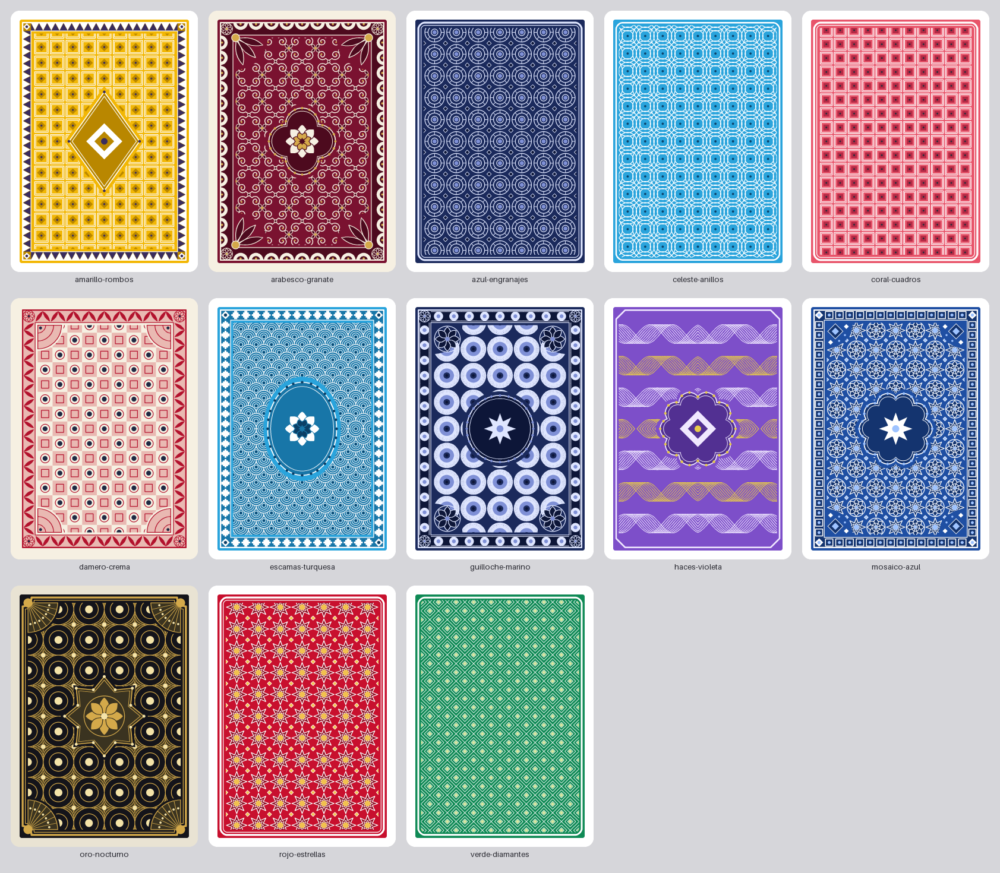
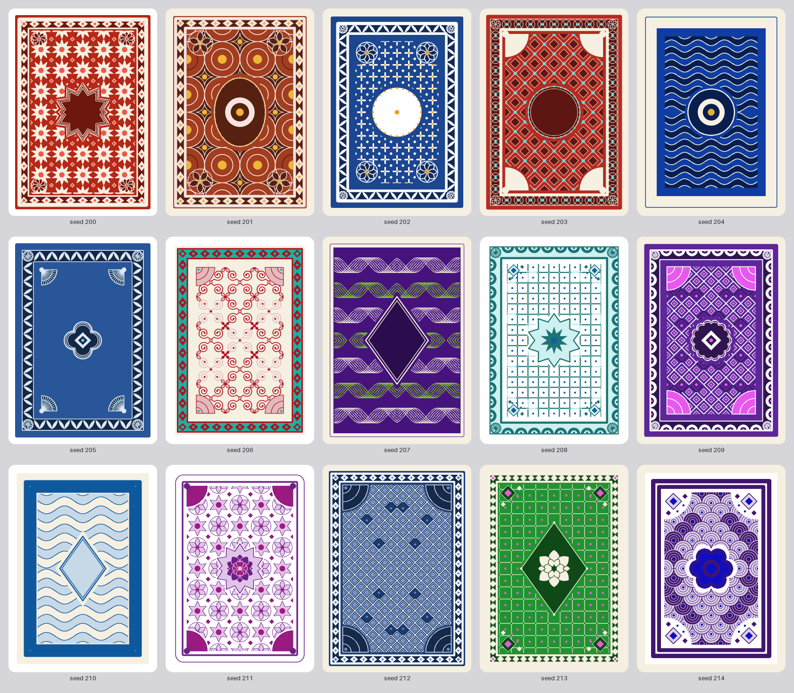

# Generador de dorsos

Genera proceduralmente dorsos de cartas tradicionales (simétricos, densos, ornamentales,
con paleta limitada y sin orientación evidente) a partir de primitivas geométricas. Sin
imágenes externas; la única dependencia es Pillow.

- **Formatos**: póker 63×88 mm y baraja española 61,5×95 mm (o `custom`).
- **Salida**: PNG a tamaño físico correcto (300 ppp por defecto, configurable; el `dpi`
  va en la cabecera y la configuración en un chunk de texto) y SVG en milímetros.
- **Todo es configuración JSON**: la misma configuración da siempre la misma imagen.




## Instalación

```bash
pip install -r requirements.txt
```

Requiere Python 3.10 o superior. Se ejecuta desde esta carpeta (`generador-dorsos/`).

## Uso rápido

```bash
# Un preset a 300 ppp, PNG + SVG en salida/
python -m dorsos generate --preset rojo-estrellas

# Baraja española, 600 ppp, solo PNG
python -m dorsos generate --preset oro-nocturno --format espanola --dpi 600 --formats png

# Ajustar cualquier parámetro con rutas del JSON
python -m dorsos generate --preset verde-diamantes \
    --set frame.kind=geometrico --set 'frame.options={"motif":"puntos"}' \
    --set medallion.kind=roseta --set style.density=0.8 --set palette.background=#0b3d2e

# Diez dorsos aleatorios reproducibles (semillas 100..109), guardando su JSON
python -m dorsos generate --random --seed 100 --count 10 --save-config

# Aleatorizar pero conservando la paleta y el marco de un preset
python -m dorsos generate --preset arabesco-granate --random --seed 7 --lock palette frame

# Hoja de muestras en cuadrícula (presets o aleatorios)
python -m dorsos sheet --presets --cols 5 -o salida/presets.png
python -m dorsos sheet --random --count 15 --seed 1 --cols 5 -o salida/aleatorios.png

# Listar presets y módulos con todas sus opciones
python -m dorsos presets
python -m dorsos modules pattern
```

Desde Python:

```python
from dorsos import DorsoConfig, build_scene, render_png, render_svg, save_png

cfg = DorsoConfig.from_dict({"pattern": {"kind": "guilloche"}, "medallion": {"kind": "rombo"}, "seed": 3})
scene = build_scene(cfg)
save_png(render_png(scene, cfg.dpi), "dorso.png", cfg.dpi, scene.metadata)
open("dorso.svg", "w", encoding="utf-8").write(render_svg(scene))
```

## Configuración

`--config fichero.json`, `DorsoConfig.load()` y los presets usan el mismo esquema. Todo
campo omitido toma su valor por defecto; una clave desconocida o un valor fuera de rango
es un error.

```json
{
  "version": 1,
  "format": "poker",
  "dpi": 300,
  "seed": 1,
  "palette": {"background": "#c8102e", "primary": "#ffffff", "secondary": "#8a0b20",
              "accent": "#f2c14e", "paper": "#ffffff"},
  "style": {"density": 0.5, "scale": 1.0, "margin_mm": 3.0, "line_width_mm": 0.25,
            "corner_radius_mm": 3.0},
  "symmetry": {"bilateral": true, "rotational_180": true},
  "frame":     {"kind": "doble",   "enabled": true, "options": {}},
  "pattern":   {"kind": "rombos",  "enabled": true, "options": {"style": "arlequin"}},
  "medallion": {"kind": "circulo", "enabled": true, "options": {"interior": "estrella"}},
  "corners":   {"kind": "none",    "enabled": true, "options": {}}
}
```

| Parámetro | Significado |
|---|---|
| `palette` | Fondo del campo, trazo principal (`primary`), tono medio (`secondary`), acento y color del papel (margen de la carta). Los módulos eligen roles o `#rrggbb`. |
| `style.density` | 0–1. Cantidad de detalle dentro de cada motivo (contornos anidados, pétalos extra, anillos). |
| `style.scale` | Multiplica el tamaño de los motivos de patrón (más escala, menos celdas). |
| `style.margin_mm` | Margen de papel entre el borde de la carta y el campo. |
| `style.line_width_mm` | Grosor base; cada módulo lo multiplica por su `weight`. |
| `style.corner_radius_mm` | Redondeo de la carta. Fuera de él el PNG es transparente. |
| `symmetry` | `bilateral` (espejo izquierda-derecha) y `rotational_180`. Con ambas la carta es idéntica al girarla y al voltearla en cualquier eje. |
| `seed` | Semilla. Determina la randomización y la `variation` de los patrones. |
| `<ranura>.enabled` | Apaga un módulo sin perder sus opciones. `kind: "none"` es equivalente. |

### Módulos

| Ranura | Módulos |
|---|---|
| `frame` | `simple`, `doble`, `geometrico` (rombos, dientes, cuadros, puntos, escalones), `ornamentado` (festones, perlas, hojas, cadeneta) |
| `pattern` | `rombos`, `reticula`, `rosetas`, `ondas`, `arabescos`, `guilloche` (cada uno con varias variantes en `style`) |
| `medallion` | `circulo`, `ovalo`, `rombo`, `roseta`, `cuatrilobulo`, `estrella`, con motivo `interior` |
| `corners` | `cuarto_circulo`, `abanico`, `roseta`, `rombos`, `hojas` |

Las ranuras son independientes y se combinan libremente. Cada módulo usa su propio flujo
aleatorio, así que activar o desactivar uno no cambia el aspecto de los demás.
`python -m dorsos modules` muestra todas las opciones con sus rangos.

### Randomización y bloqueos

`--random` genera un diseño nuevo desde `--seed` (o una semilla aleatoria que se imprime).
`--lock RUTA…` conserva partes del diseño base; las rutas de `--set` se bloquean solas.
Rutas válidas: bloques (`palette`, `style`, `frame`, `pattern`, `medallion`, `corners`,
`seed`), campos (`palette.background`, `frame.kind`, `style.density`) y opciones
(`pattern.options.style`). Bloquear `pattern.kind` conserva el patrón pero randomiza sus
variantes. `format`, `dpi` y `symmetry` nunca se randomizan.

## Estructura

```
generador-dorsos/
├── dorsos/
│   ├── constants.py  config.py  errors.py  registry.py     # datos y validación
│   ├── geometry.py  primitives.py  scene.py                 # geometría y escena
│   ├── compose.py                                           # configuración → escena
│   ├── render_png.py  render_svg.py                         # salidas
│   ├── palettes.py  presets.py  presets/*.json  randomize.py
│   ├── sheet.py  cli.py  __main__.py
│   └── modules/  frames.py  medallions.py  corners.py  motifs.py  patterns/
├── tests/          # pytest
├── docs/methodology/model.tex          # matemáticas: retículas, simetría, curvas
├── docs/documentation/module.md        # referencia de cada módulo
└── muestras/       # hojas de muestras generadas con `sheet`
```

Cada módulo ornamental declara sus opciones con `Opt`; de ahí salen la validación, los
valores por defecto, la randomización y el listado de `modules`. Añadir un módulo es una
clase con `@register("pattern", "nombre")`; ver `docs/documentation/module.md`.

## Cómo funciona la simetría

Cada módulo dibuja la carta entera. Después se conserva un dominio fundamental (mitad
izquierda para la bilateral, mitad superior para el giro, cuadrante superior izquierdo
para ambas) y se replica con las isometrías del grupo. Por eso cualquier variación
aleatoria por celda sale simétrica sin que el módulo lo sepa. En PNG es exacta a nivel de
píxel; en SVG se usan `<use>` con `<clipPath>`. Detalle en `docs/methodology/model.tex`.

## Pruebas y documentación matemática

```bash
python -m pytest                       # 312 pruebas, unos 12 s
cd docs/methodology && pdflatex model.tex && pdflatex model.tex
```

Las pruebas comprueban tamaño físico y `dpi` del PNG, determinismo por semilla, simetría
píxel a píxel, ida y vuelta del JSON, que cada módulo y cada valor de cada opción se
dibuja, bloqueos de la randomización, SVG válido y la CLI.

## Limitaciones

- Los nombres de parámetros del JSON están en inglés y los valores de dominio (`rombos`,
  `doble`…) en español.
- La calidad visual de las combinaciones aleatorias es desigual: los rangos de
  randomización se afinaron a ojo sobre hojas de muestras, no con una métrica.
- El SVG no se ha validado en Illustrator ni Inkscape; sí en un navegador. La costura
  central de la simetría puede notarse como una línea muy fina según el visor.
- Los motivos de los patrones `arabescos` son esquemáticos; no imitan grabados
  ornamentales complejos como los de Fournier.
- El PNG es RGB(A) sin perfil de color ni sangrado de impresión.
